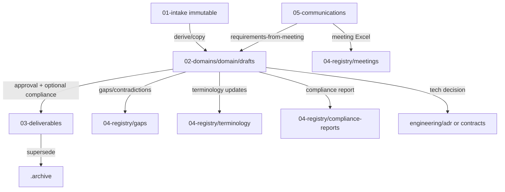

# Структура проекта и жизненный цикл документа

**Образец для hub-шаблона** `project-template`  
**Версия:** 1.0  
**Расположение образца:** `platform/samples/document-lifecycle/`  
**Каноническое правило layout:** `.cursor/rules/040-docs-layout.mdc`  
**Пути по умолчанию:** `project.manifest.yaml` → `paths.*`

Этот файл — полное описание: что лежит в каждой папке, какие артефакты Cursor/tools за что отвечают, и **в каком порядке** пользователь создаёт документ, включая **миграции** между разделами.

---

## 1. Принципы (не ломаем текущую модель)

1. Сохраняется layout **00-knowledge → 06-quality** + `engineering/` (не заменяется на модель rosset2 `01-input/02-working/03-output`).
2. `01-intake` всегда **immutable** для агентов.
3. Черновики живут в **`02-domains/<domain>/drafts/`**; публикация — в **`03-deliverables/`**.
4. Новые подразделы добавляются только при явной необходимости (в v0.1+ добавлен опциональный `normative/_derived/` и каталог образца `platform/samples/`).
5. Универсальный инструментарий усилен по паттернам боевого spoke (команды, plan-gate, индексы `README`/`file-list`) без переноса доменной логики.

---

## 2. Дерево репозитория и назначение

```
project-template/
├── .cursor/                 # Rules, Agents, Skills, Commands, Starter prompts
├── .meta/mirrors/           # RU-зеркала артефактов Cursor
├── .meta/pipeline/          # Временные промежуточные файлы пайплайнов
├── .archive/                # Устаревшие копии (spoke policy)
├── docs/                    # Документационный контур проекта
├── engineering/             # Инженерный контур
├── platform/                # Hub: архитектура, deployment, templates, samples
├── tools/                   # Скрипты автоматизации
├── project.manifest.yaml    # Манифест spoke (заполняется при клонировании)
└── README.md
```

### 2.1. `docs/` — по разделам

| Путь | Назначение | Типичное содержимое | Кто пишет |
|------|------------|------------------|-----------|
| `docs/00-knowledge/` | База знаний проекта | README, file-list | человек / indexer |
| `docs/00-knowledge/glossary/` | Локальные терминологические материалы | таблицы терминов | BA + guards |
| `docs/00-knowledge/normative/` | Библиотека стандартов (тело read-only) | pdf/md/docx стандартов | человек (add/remove) |
| `docs/00-knowledge/normative/_derived/` | Опциональные индексы бинарной нормативки | `.agent.md`, `.toc.json` | tooling (перегенерация) |
| `docs/01-intake/` | Пакет заказчика, **не редактировать** | ТЗ, устав, решения | заказчик / PM (укладка) |
| `docs/02-domains/` | Предметные домены | `<domain>/drafts/…` | BA / агенты |
| `docs/02-domains/<domain>/drafts/` | Черновики до утверждения | md/docx drafts | BA / агенты |
| `docs/03-deliverables/` | Утверждённые результаты для заказчика | финальные md/pdf | BA/PM после approval |
| `docs/04-registry/` | Реестры и служебные отчёты | file-registry, gaps, compliance, meetings, terminology | агенты + BA |
| `docs/04-registry/gaps/` | Зафиксированные пробелы/противоречия | `gap-*.md` | guards / BA |
| `docs/04-registry/compliance-reports/` | Отчёты compliance | отчёты по шаблону | compliance pipeline |
| `docs/04-registry/meetings/` | Артефакты задач встреч | xlsx/json | meeting pipeline |
| `docs/04-registry/terminology/` | Канонические термины (часто `canonical_file`) | `terms.md`, ASR maps | BA + terminology guard |
| `docs/05-communications/` | Встречи и коммуникации | transcripts, media, protocols | ingest + meeting skills |
| `docs/05-communications/_imports/mymeet/` | Сырой импорт MCP | `.json` | mymeet-meeting-import |
| `docs/05-communications/transcripts/` | Транскрипты | `.md` | MyMeet MCP / merge / человек |
| `docs/05-communications/media/` | Скриншоты и вложения | png/… | человек / MyMeet |
| `docs/05-communications/protocols/` | Краткие протоколы/мемо | `.md` | BA / агенты |
| `docs/06-quality/` | Качество и приёмка | acceptance, eval | QA / BA |
| `docs/06-quality/acceptance/` | Критерии приёмки | чеклисты | QA |
| `docs/06-quality/eval/golden-set/` | Эталоны eval пайплайнов | README + кейсы | hub maintainers |

В каждом крупном разделе `docs/0N-*` поддерживаются:

- `README.md` — зачем раздел и правила миграции;
- `file-list.md` — индекс файлов (обновляет `@structure-indexer`).

### 2.2. `engineering/`

| Путь | Назначение |
|------|------------|
| `engineering/integrations/` | Описания интеграций |
| `engineering/contracts/` | API-контракты |
| `engineering/adr/` | Architecture Decision Records |
| `engineering/src/` | Код (если репо включает разработку) |

### 2.3. `platform/` (hub)

| Путь | Назначение |
|------|------------|
| `platform/architecture/` | Hub vs Spoke, routing, STATUS |
| `platform/deployment/` | Git, AI-контур, MyMeet MCP |
| `platform/domain-packs/` | Расширения для spoke |
| `platform/templates/` | Шаблоны отчётов/терминов/встреч |
| `platform/samples/document-lifecycle/` | **Этот образец** структуры и workflow |
| `platform/project.manifest.schema.json` | JSON Schema манифеста |

### 2.4. `.cursor/` — инструментарий Cursor

| Путь | Назначение |
|------|------------|
| `rules/*.mdc` | Постоянные правила (layout, search, compliance, writing, dev) |
| `agents/*.md` | Субагенты (`@name`) |
| `skills/*/SKILL.md` | Пайплайны-оркестраторы |
| `commands/*.md` | Slash-команды `/…` → вход в skill |
| `STARTER_PROMPT_*.md` | Готовые промпты для пользователя |
| `RULES_REGISTRY.md` / `*/AGENTS_CATALOG.md` / `*/SKILLS_CATALOG.md` | Каталоги |
| `plans/` | Локальные планы сессий (не deliverable) |

### 2.5. `tools/`

| Файл | Назначение |
|------|------------|
| `run_structure_indexer.py` | Обновление `file-registry.md` / поддержка индексов |
| `merge_meeting_transcript_parts.py` | Склейка частей транскрипта |
| `parse_screenshot_timecode.py` | Таймкоды из имён скриншотов |
| `build_meeting_task_report_xlsx.py` | Excel задач встречи |
| `vks_export_to_repo.py` | Deprecated stub (не использовать в новых проектах) |
| `requirements-tools.txt` | Зависимости Python для tools |

### 2.6. Служебные

| Путь | Назначение |
|------|------------|
| `.meta/mirrors/` | Русские зеркала rules/agents/skills |
| `.meta/pipeline/` | Scratch пайплайнов (не публиковать заказчику) |
| `.archive/` | Снятые с публикации версии (spoke) |
| `project.manifest.yaml` | Идентичность проекта и пути |

---

## 3. Миграции между разделами



| # | Из | В | Триггер | Что делать | Чего не делать |
|---|----|---|---------|------------|----------------|
| M1 | `01-intake` | `02-domains/.../drafts` | Старт анализа/написания | Копировать или писать derived-черновик | Удалять/править intake |
| M2 | `05-communications` | `02-domains/.../drafts` | Решения встречи влияют на требования | `/requirements-from-meeting` | Считать транскрипт deliverable |
| M3 | `02-domains/.../drafts` | `03-deliverables` | Утверждение BA/PM | Публикация финала; при `compliance.enabled` — `/compliance-check-pipeline` | Публиковать без approval |
| M4 | любой draft/check | `04-registry/gaps` | PASS WITH GAPS / нехватка данных | Создать gap-файл | Игнорировать молча |
| M5 | `05-communications` | `04-registry/meetings` | Нужен реестр задач | Meeting pipeline → xlsx | Класть Excel в intake |
| M6 | draft/deliverable | `04-registry/terminology` | Новые согласованные термины | Обновить canonical_file | Плодить второй «канон» без решения |
| M7 | draft | `engineering/*` | Техрешение / API | ADR или contract | Дублировать длинный ADR только в docs без ссылки |
| M8 | `03-deliverables` | `.archive` | Замена мажорной версии | Перенос старой версии + обновление индексов | Молча затирать историю |

---

## 4. Последовательность действий: новый документ

### 4.1. Быстрый чеклист пользователя

```
создание документа
- [ ] 1. Определить domain-id и имя файла
- [ ] 2. Найти источники в 01-intake / 05-communications / 00-knowledge
- [ ] 3. (Крупная задача) /plan-gate — план и команда субагентов, ждать сигнал
- [ ] 4. Создать черновик в docs/02-domains/<domain>/drafts/
- [ ] 5. При необходимости: термины → @terminology-consistency-guard
- [ ] 6. Перед выдачей заказчику: /compliance-check-pipeline
- [ ] 7. Закрыть/принять гэпы (BA)
- [ ] 8. Миграция M3 → docs/03-deliverables/
- [ ] 9. /project-init не нужен; вызвать @structure-indexer («обнови file-list»)
```

### 4.2. Подробный сценарий A — документ из intake

1. Убедиться, что материалы лежат в `docs/01-intake/` (при первом проекте — `/project-init-pipeline`).
2. Выбрать домен: например `docs/02-domains/core/drafts/`.
3. Создать `…/drafts/<имя-документа>.md` (можно начать с `platform/templates/` если подходит).
4. Писать, ссылаясь на intake (**015/016** — цитаты источников).
5. Прогнать guards / `/compliance-check-pipeline`.
6. После approval — скопировать/перенести финал в `docs/03-deliverables/`.
7. Обновить индексы: попросить `@structure-indexer` или «обнови file-list».

### 4.3. Сценарий B — документ из встречи

1. Встреча в **mymeet.ai** со статусом `processed` (ключ `MYMEET_API_KEY`, MCP `mymeet`).
2. `/mymeet-meeting-pipeline` — импорт → нормализация + Excel задач.
3. `/requirements-from-meeting` — diff в **drafts** (не в intake).
4. Доработать черновик → compliance → deliverable (как в A).

Если `.md` уже в `transcripts/` → `/meeting-transcript-pipeline`.

### 4.4. Сценарий C — инженерный артефакт

1. `/plan-gate` на задачу.
2. ADR → `engineering/adr/`; код → `engineering/src/` через `/spec-to-code-pipeline`.
3. При необходимости краткая customer-facing выжимка — отдельный draft/deliverable в docs.

---

## 5. Универсальная компоновка Cursor (итог отбора)

Сводка отбора из hub + референса rosset2: см. [UNIVERSAL-PACK.md](./UNIVERSAL-PACK.md).

**Включено в hub сейчас**

| Слой | Состав |
|------|--------|
| Rules | 17 core (в т.ч. усиленный **040** с миграциями) |
| Agents | 9 core (indexer, guards, meeting, code-reviewer, search) |
| Skills | 6 pipeline + **`plan-gate`** |
| Commands | `/plan-gate`, init, compliance, meeting, search, spec-to-code, requirements-from-meeting |
| Starters | 6 STARTER_PROMPT_* (добавлен requirements) |
| Tools | indexer, merge, timecode, meeting xlsx; MyMeet via MCP |

**Не перенесено в hub (осознанно)** — домен Rosseti/Minenergo/OPE, GOST-only жёсткие стили писем, узкие BPMN/onboarding пайплайны. Рекомендуются как spoke / domain-pack при необходимости (список в UNIVERSAL-PACK.md).

---

## 6. Шаблоны (`platform/templates/`)

| Файл | Когда использовать |
|------|-------------------|
| `terms-template.md` | Старт glossary / canonical terms |
| `gap-template.md` | Новый файл в `04-registry/gaps/` |
| `compliance-report-template.md` | Отчёт compliance |
| `meeting-tasks.*` | Колонки/пример Excel задач встречи |
| `meeting-transcript-part*.example.md` | Формат частей для merge |

---

## 7. Связанные документы

- [hub-vs-spoke.md](../../architecture/hub-vs-spoke.md)
- [AI-contour-setup.md](../../deployment/AI-contour-setup.md)
- [smart-routing-matrix.md](../../architecture/smart-routing-matrix.md)
- `.cursor/RULES_REGISTRY.md`, `agents/AGENTS_CATALOG.md`, `skills/SKILLS_CATALOG.md`
